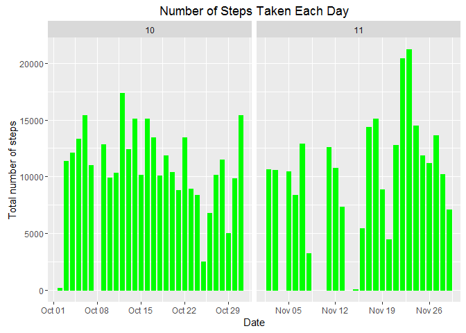

Sitting
-------

    echo = TRUE

Loading and preprocessing the data
----------------------------------

    data <- read.csv("activity.csv", colClasses = c("integer", "Date", "factor"))
    data$month <- as.numeric(format(data$date, "%m"))
    noNA <- na.omit(data)
    rownames(noNA) <- 1:nrow(noNA)
    head(noNA)

    ##   steps       date interval month
    ## 1     0 2012-10-02        0    10
    ## 2     0 2012-10-02        5    10
    ## 3     0 2012-10-02       10    10
    ## 4     0 2012-10-02       15    10
    ## 5     0 2012-10-02       20    10
    ## 6     0 2012-10-02       25    10

    dim(noNA)

    ## [1] 15264     4

What is mean total number of steps taken per day?
-------------------------------------------------

For this part of the assignment, you can ignore the missing values in
the dataset.

1.  Make a histogram of the total number of steps taken each day

<!-- -->

    library(ggplot2)
    ggplot(noNA, aes(date, steps)) + geom_bar(stat = "identity", fill = "green", colour = "green",  width = 0.68) + facet_grid(. ~ month, scales = "free") + labs(title = "Number of Steps Taken Each Day", x = "Date", y = "Total number of steps")

1.  Process/transform the data (if necessary) into a format suitable for
    your analysis Mean total number of steps taken per day:

<!-- -->

    totalSteps <- aggregate(noNA$steps, list(Date = noNA$date), FUN = "sum")$x
    mean(totalSteps)

    ## [1] 10766.19

Median total number of steps taken per day:

    median(totalSteps)

    ## [1] 10765

What is the average daily activity pattern?
-------------------------------------------

1.  Make a time series plot (i.e. type = "l") of the 5-minute
    interval (x-axis) and the average number of steps taken, averaged
    across all days (y-axis)

<!-- -->

    avg <- aggregate(noNA$steps, list(interval = as.numeric(as.character(noNA$interval))), FUN = "mean")
    names(avg)[2] <- "meanSteps"

    ggplot(avg, aes(interval, meanSteps)) + geom_line(color = "green", size = 1) + labs(x = "5-minute intervals", y = "Average Number of Steps Taken")

1.  Which 5-minute interval, on average across all the days in the
    dataset, contains the maximum number of steps?

<!-- -->

    avg[avg$meanSteps == max(avg$meanSteps), ]

    ##     interval meanSteps
    ## 104      835  206.1698

Imputing missing values
-----------------------

Note that there are a number of days/intervals where there are missing
values (coded as NA). The presence of missing days may introduce bias
into some calculations or summaries of the data.

1.  Calculate and report the total number of missing values in the
    dataset (i.e. the total number of rows with NAs)

<!-- -->

    sum(is.na(data))

    ## [1] 2304

1.  Devise a strategy for filling in all of the missing values in
    the dataset. The strategy does not need to be sophisticated. For
    example, you could use the mean/median for that day, or the mean for
    that 5-minute interval, etc.

The strategy: Using the mean for that 5-minute interval to fill in all
of the missing values in the dataset.

1.  Create a new dataset that is equal to the original dataset but with
    the missing data filled in.

<!-- -->

    newData <- data 
    for (i in 1:nrow(newData)) {
        if (is.na(newData$steps[i])) {
            newData$steps[i] <- avg[which(newData$interval[i] == avg$interval), ]$meanSteps
        }
    }

    head(newData)

    ##       steps       date interval month
    ## 1 1.7169811 2012-10-01        0    10
    ## 2 0.3396226 2012-10-01        5    10
    ## 3 0.1320755 2012-10-01       10    10
    ## 4 0.1509434 2012-10-01       15    10
    ## 5 0.0754717 2012-10-01       20    10
    ## 6 2.0943396 2012-10-01       25    10

    sum(is.na(newData))

    ## [1] 0

1.  Make a histogram of the total number of steps taken each day and
    Calculate and report the mean and median total number of steps taken
    per day. Do these values differ from the estimates from the first
    part of the assignment? What is the impact of imputing missing data
    on the estimates of the total daily number of steps?

<!-- -->

    ggplot(newData, aes(date, steps)) + geom_bar(stat = "identity", fill = "green", colour = "green",  width = 0.68) + facet_grid(. ~ month, scales = "free") + labs(title = "Number of Steps Taken Each Day", x = "Date", y = "Total number of steps")

Mean total number of steps taken per day

    newTotal <- aggregate(newData$steps, 
                               list(Date = newData$date), 
                               FUN = "sum")$x
    newMean <- mean(newTotal)
    newMean

    ## [1] 10766.19

Median total number of steps taken per day

    newMedian <- median(newTotal)
    newMedian

    ## [1] 10766.19

Compare them with the two before imputing missing data

    newMean -  mean(totalSteps)

    ## [1] 0

    newMedian - median(totalSteps)

    ## [1] 1.188679

As a result, the new mean of total step taken per day is the same as the
old mean, but the new median of total steps taken perday is greater than
the old median.

Are there differences in activity patterns between weekdays and weekends?
-------------------------------------------------------------------------

For this part the weekdays() function may be of some help here. Use the
dataset with the filled-in missing values for this part.

1.  Create a new factor variable in the dataset with two levels -
    "weekday" and "weekend" indicating whether a given date is a weekday
    or weekend day.

<!-- -->

    newData$weekdays <- factor(format(newData$date, "%A"))
    levels(newData$weekdays) <- list(weekday = c("Monday", "Tuesday",
                                                 "Wednesday", 
                                                 "Thursday", "Friday"),
                                     weekend = c("Saturday", "Sunday"))
    levels(newData$weekdays)

    ## [1] "weekday" "weekend"

1.  Make a panel plot containing a time series plot (i.e. type = "l") of
    the 5-minute interval (x-axis) and the average number of steps
    taken, averaged across all weekday days or weekend days (y-axis).
    See the README file in the GitHub repository to see an example of
    what this plot should look like using simulated data.

<!-- -->

    avg <- aggregate(newData$steps, 
                          list(interval = as.numeric(as.character(newData$interval)), 
                               weekdays = newData$weekdays),
                          FUN = "mean")
    names(avg)[3] <- "meanOfSteps"
    library(lattice)
    xyplot(avg$meanOfSteps ~ avg$interval | avg$weekdays, 
           layout = c(1, 2), type = "l", 
           xlab = "Interval", ylab = "Number of steps")

